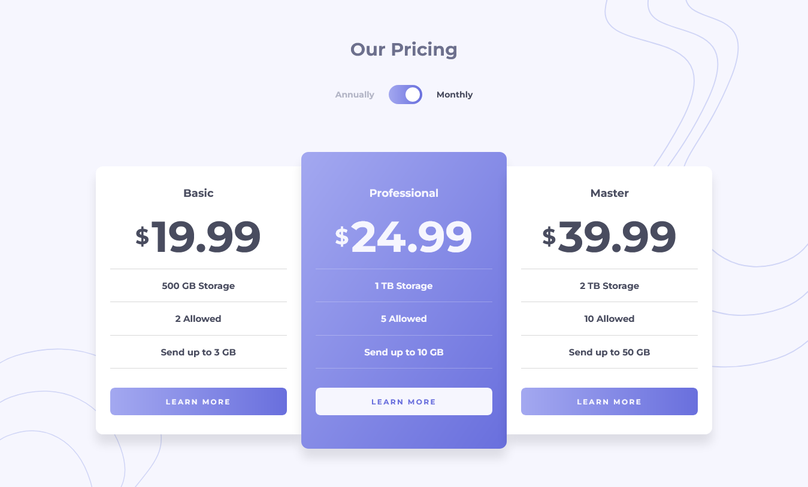

# Frontend Mentor - Pricing component with toggle solution

This is a solution to the [Pricing component with toggle challenge on Frontend Mentor](https://www.frontendmentor.io/challenges/pricing-component-with-toggle-8vPwRMIC). Frontend Mentor challenges help you improve your coding skills by building realistic projects.

## Table of contents

- [Overview](#overview)
  - [The challenge](#the-challenge)
  - [Screenshot](#screenshot)
  - [Links](#links)
- [My process](#my-process)
  - [Built with](#built-with)
  - [Continued development](#continued-development)
- [Author](#author)
- [Acknowledgments](#acknowledgments)

**Note: Delete this note and update the table of contents based on what sections you keep.**

## Overview

### The challenge

Users should be able to:

- View the optimal layout for the component depending on their device's screen size
- Control the toggle with both their mouse/trackpad and their keyboard
- **Bonus**: Complete the challenge with just HTML and CSS

### Screenshot

### Links

- Solution URL: [source code](https://github.com/codexshell/pricing-component-with-toggle)
- Live Site URL: [website](https://pricing-component-with-toggle-kappa-two.vercel.app/)

## My process

### Built with

- Semantic HTML5 markup
- CSS custom properties
- Flexbox
- CSS Grid
- Mobile-first workflow
- [SvelteKit](https://svelte.dev/https://reactjs.org/) - Svelte framework

### Continued development

- [Convential Commits](https://www.conventionalcommits.org/en/v1.0.0/)

## Author

- Website - [Silvanos Eric](https://codexshell.github.io/)
- Frontend Mentor - [@codexshell](https://www.frontendmentor.io/profile/codexshell)
- Twitter - [@codexshell](https://twitter.com/codexshell)